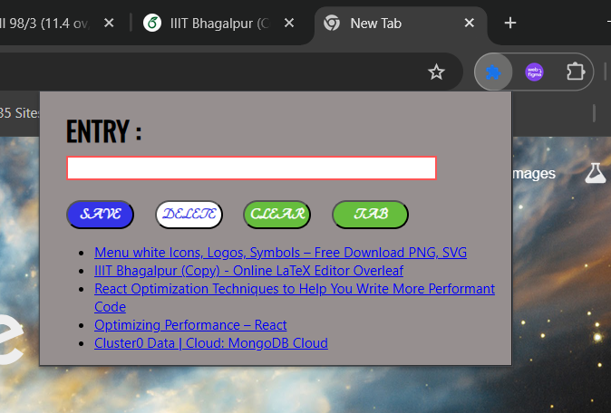

# 🔖 Bookmarker Chrome Extension

A lightweight and minimal Chrome Extension to quickly save, view, and manage website links (bookmarks) from either user input or the active browser tab.

---

## 📌 Features

- ✅ Save any URL manually through input
- 🌐 Save the current tab's URL and title
- 📋 View bookmarks as clickable links
- 🗑️ Delete the last saved link
- 🧹 Clear all saved links
- 💾 Bookmarks are stored locally using `localStorage`

---

## 🛠️ Tech Stack

- HTML5
- CSS3
- JavaScript (ES6)
- Chrome Extension API

---

## 🚀 Getting Started

- git clone https://github.com/raktimava29/Extension.git
- cd Extension
  
## 📸 Screenshot

